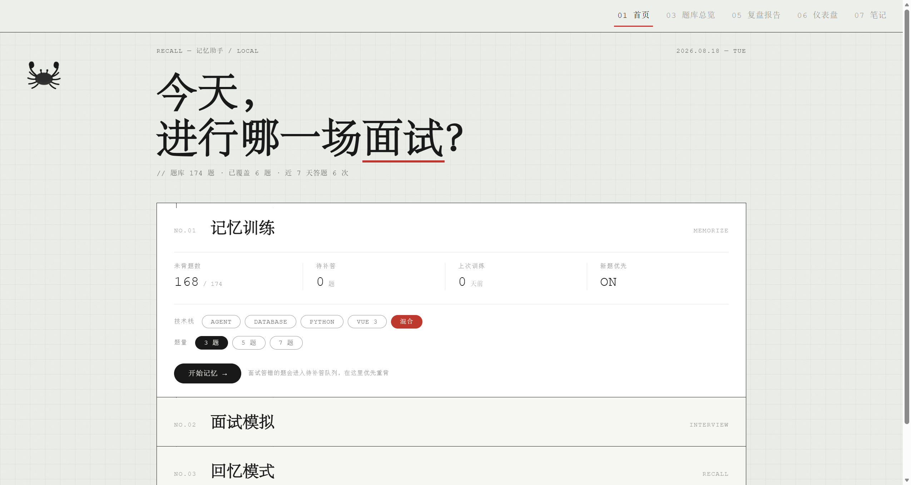
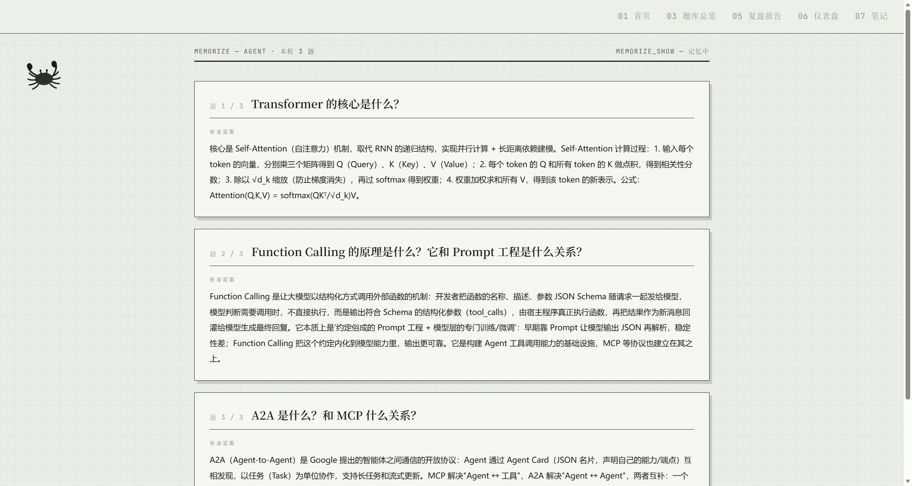
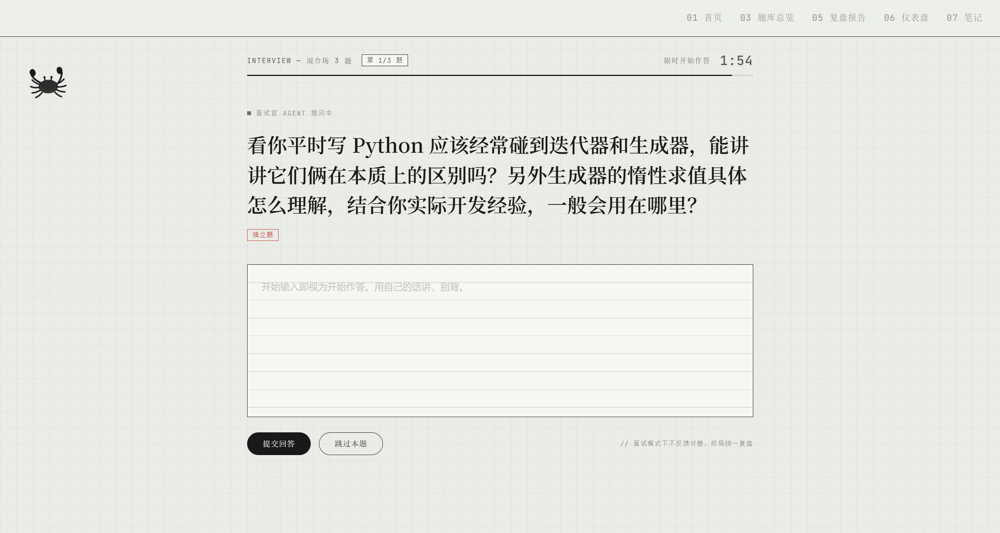
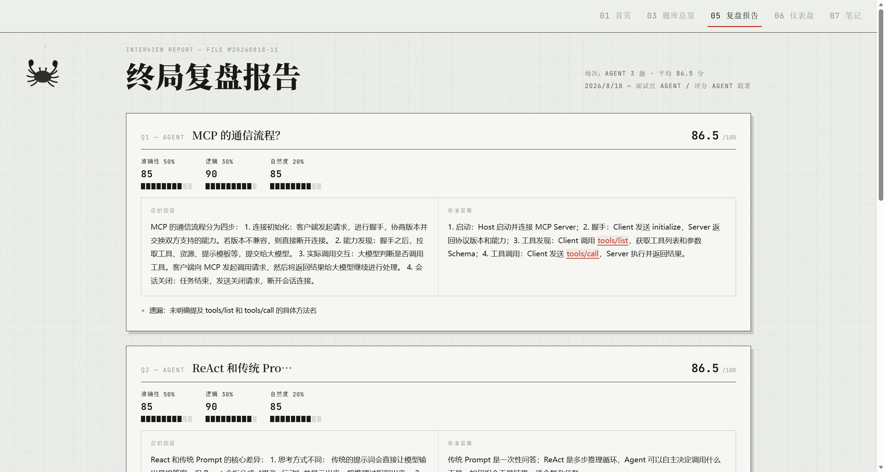
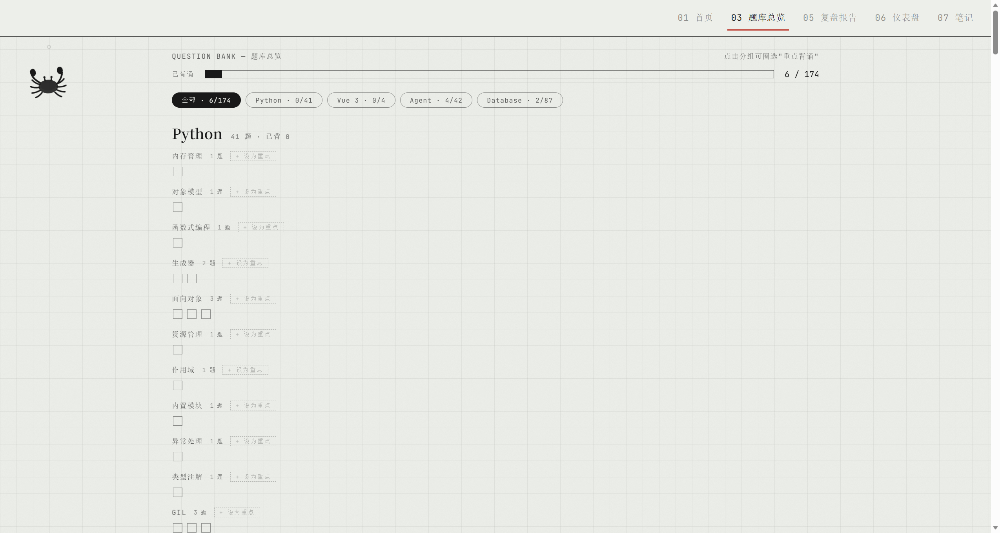
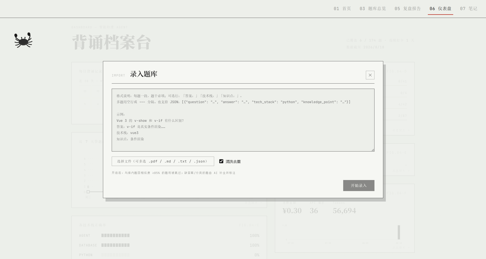
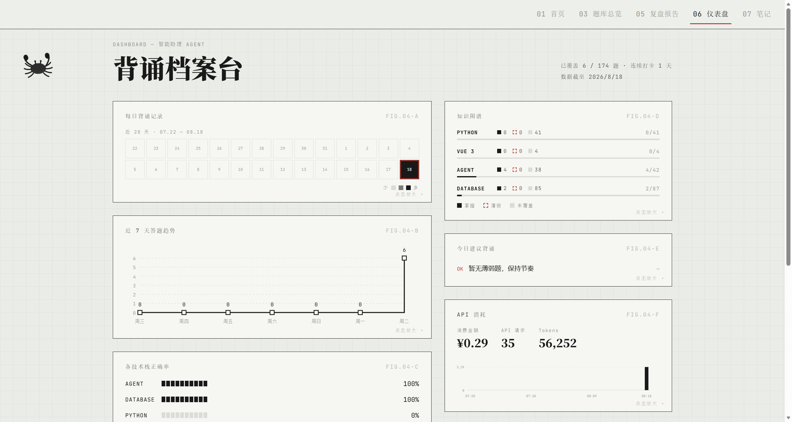
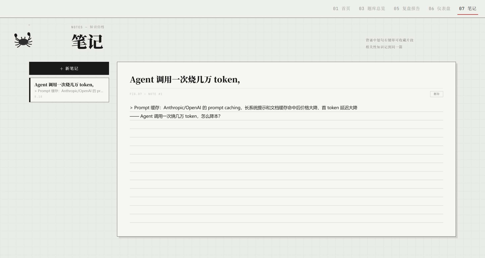
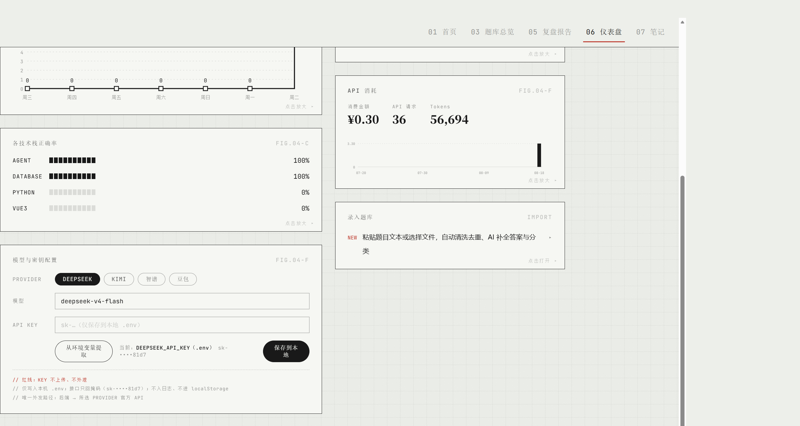

# Recall · 记忆助手

一个本地跑的八股背诵工具。面试官口吻出题、AI 判分、终局复盘，外加一个纸墨风的仪表盘。
FastAPI + Vue 3，数据全在自己电脑上的 SQLite 里，不联网也能看个大概（联网是为了调 LLM）。

## 为什么写这个

前阵子准备面试，八股文翻来覆去地看，看的时候都懂，被问到就卡壳。
后来想明白一件事：背东西得有"考"的环节，光看是没用的。
市面上的 Anki 类工具又只管抽认不管判分，于是就自己写了一个：
它负责出题、追问、判分、挑刺（还会检测你是不是在逐字背标答），我负责挨虐。
用了一段时间，效果还行，就把代码整理了一下放上来。

## 长什么样

整体是纸墨风，像一本摊开的面试笔记。所有图表都是手绘 SVG，没有用任何图表库。



首页三个抽屉：记忆训练、面试模拟、回忆模式（简易艾宾浩斯，专挑快忘的题）。
选好技术栈和题量就能开始。



记忆训练先把题干和标准答案给你看，点"我记好了"之后打乱顺序开考，
题干会换成面试官口吻的变体（每次都不一样）。答完一题立刻出分：
准确性 / 逻辑 / 自然度三个维度，自然度就是防背诵的——
跟标答逐字重合度太高，这维度直接压到 30 分以下。



面试模拟是另一套规则：限时两分钟、全程不告诉对错、答错也不给反馈，
全部答完才出终局复盘。面试官会追问，跳过直接判负，压力感拉满。



复盘报告会逐题对照你的回答和标准答案，遗漏的要点用红色标出来，
还会给薄弱点分析和后续建议。答错的题自动进"待补答"队列，
下次记忆训练优先重背。



题库总览按 技术栈 → 知识点 两级分组，每个知识点一格，背过就涂黑。
内置 174 题（Python / Agent / 数据库 / Vue3），也可以喂自己的资料。



录入支持粘贴文本，也支持直接上传 md / txt / json / pdf（可多选）。
整篇八股文扔进去就行，LLM 会把里面真正的面试题挑出来，
缺答案的 AI 补全，重复的自动跳过。录入在后台跑，进度随时回来看。



仪表盘汇总了每日背诵记录、答题趋势、各技术栈正确率、知识图谱，
还有 API 消耗统计——每次调用花了多少 token、估算了多少钱都记着，
连失败的调用也照实记账（官网对失败请求也是计费的）。



背诵的时候看到好的句子，选中右键就能存进笔记。
笔记是文档式的，相关知识可以慢慢攒到一起。

## 跑起来

需要 Python 3.11+ 和 Node 18+。

**1. 后端（端口 8000）**

```bash
cd backend
python -m venv .venv
source .venv/Scripts/activate    # Windows Git Bash；CMD 用 .venv\Scripts\activate
pip install -r requirements.txt
```

在项目**根目录**建一个 `.env`：

```ini
DEEPSEEK_API_KEY=sk-...   # 必填：出题变体 / 判分 / 助理对话都靠它
KIMI_API_KEY=sk-...       # 可选：备用 Provider，DeepSeek 挂了自动切
```

```bash
cd backend
uvicorn main:app --port 8000
```

**2. 前端（端口 5173）**

```bash
cd frontend
npm install
npm run dev
```

浏览器打开 http://localhost:5173 就能用了。

## API Key 怎么配

两种方式都行：

- 写进根目录的 `.env`（上面那种）；
- 启动后进「仪表盘 → 模型与密钥配置」，在页面上填，效果一样（其实还是写回 `.env`）。



DeepSeek 目前两个模型：`deepseek-v4-flash`（默认，够用）和 `deepseek-v4-pro`（贵但更强）。
插句实话：判分这种活儿 flash 完全够，我这几周高强度用下来也就花了两三块钱。
另外 DeepSeek 有峰谷价，北京时间 9-12 点、14-18 点是高峰，其余时间半价——
批量导题库这种重活，扔到晚上跑能省一半。

> **红线：Key 只写在本机 `.env`，接口只回掩码，不进日志、不进 localStorage。
> `.env` 已在 `.gitignore` 里，但自己留意别截图外发。**

## 使用流程（一条龙）

1. **录题库**：仪表盘 → 录入题库，扔文件或粘文本，等它清洗完；
2. **背**：首页 → 记忆训练，看题 → 开考 → 拿即时反馈；
3. **考**：首页 → 面试模拟，体验被追问和限时的双重压力；
4. **复盘**：面试结束看终局报告，错题自动进待补答队列；
5. **攒笔记**：好句子右键存起来，慢慢攒成自己的面试手册；
6. **看账**：仪表盘盯一盯正确率走势和 API 花销。

## 技术栈

- 后端：FastAPI + SQLModel（SQLite），6 个 Agent 分工（总控 / 面试官 / 评分 / 策略 / 助理 / 录入清洗）
- 前端：Vue 3 + Vite，纸墨风，图表全部手绘 SVG，无 UI 框架
- LLM：DeepSeek / Kimi 双 Provider，超时自动切换

## 目录

```
backend/    FastAPI 应用（api 路由 / agents / llm 封装 / models / tests）
frontend/   Vue 3 单页应用（views / components / api / mock 演示数据）
data/       SQLite 库和题库源文件（本地数据，不进 git）
docs/       需求文档、方案设计、截图
```

后端有 202 项测试：`cd backend && pytest tests/ -q`

## 小贴士

- 想练"口述作答"？应用里没做语音输入，直接用腾讯输入法或豆包输入法的语音输入往答题框里说就行，比浏览器自带的识别准。
- 后端没启动时前端会回退到内置演示数据，左下角会显示"离线模式"，不会白屏。

## License

MIT，随便用，出事不担责。觉得有用就点个 Star。
